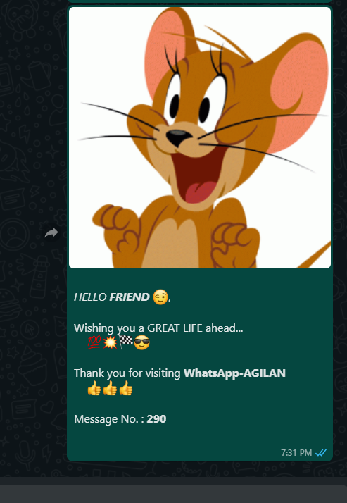

# CoolWhatsApp-API
An API hosted on **AWS Lambda** platform that allows you to receive a greeting from me on **WhatsApp**

## url
FOR INDIA (91)
> https://e24i3et9qd.execute-api.us-east-2.amazonaws.com/default/agilan-whatsapp?num=xxxxxxxxxx

FOR OTHERS 
> https://e24i3et9qd.execute-api.us-east-2.amazonaws.com/default/agilan-whatsapp?num=xxxxxxxxxx&cn=yy

Replace :
* **xxxxxxxxxx** with your **10 digit WhatsApp Number**
* **yy** with your **country-code**. Initial '+' is not required (eg. CHINA : yy = 86)

Send a **GET** request to receive a greeting message

